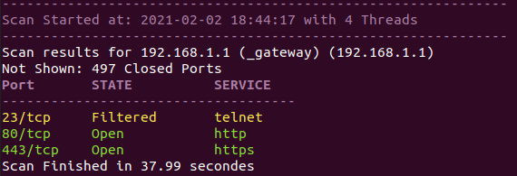

# PortScanner
Nmap-like python port scanner with different methods

This port scanner script can be used to scan a target and gather information about the status of its ports.
When using, the script will ping the target. If the target doesn't respond, you will get a warning. You can still start the scan but most likely the result is not valid.
## usage
```bash
sudo python3 PortScanner_main.py [-h] -t T -p P -s S -d D [-m]
```
This script takes 4 arguments:  
 `T` is the target. This can be an IP or a host name.  
 `P` is the port range. Example: with -p 1-100 the script will scan the ports 1 through 100 (including 100).  
 `S` is the scan method. This can be:
 - CS: Connect Scan
 - A: Ack Scan
 - S: Syn Scan
 - F: Fin Scan
 - W: Window Scan  

`D` is the Scan Delay between the ports. A reasonable value is between 0.1 and 1

Also there are 2 optional arguments:  
`-h` Displays the help message.  
`-m` Prevents multi threading. The script uses 4 threads by default. Pass this to use one thread.
## ScreenShot
